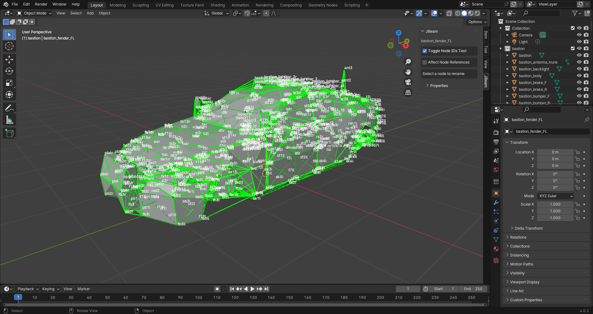

# Blender JBeam Editor
This Blender plugin allows you to import existing JBeam parts or whole vehicles, modify them with Blender's advanced modelling tools, and export them!

**NOTE: This plugin is only compatible with Blender 4.2+, this plugin will not work on older versions! You can get the latest version of Blender [here](https://www.blender.org/download/). When installing this plugin, please remove the currently installed version (if installed), install the new version, and restart Blender! And make sure to run Blender as an administrator so that file importing/exporting can work!**

## Current Features
* Import JBeam files
* Import Full Vehicle (.pc file)
* Create JBeam from scratch (on hold)
* Move/rename/add/delete nodes
* Add/delete beams, triangles, and quads
* Undo/redo changes Ctrl + [ and Ctrl + ]
* Live updates reflected in Blender text editor
* Export changes directly to disk

## User Documentation (everybody should read this!)
Find more information about installing and using this plugin [here](docs/user/user_docs.md) or [online version here](https://github.com/BeamNG/Blender-JBeam-Editor/blob/main/docs/user/user_docs.md).

 

## Developer Documentation (for plugin developers only!)
Find more information about developing this plugin [here](docs/dev/dev_docs.md) or [online version here](https://github.com/BeamNG/Blender-JBeam-Editor/blob/main/docs/dev/dev_docs.md).

 

## Other Recommended Software
* [Visual Studio Code: JBeam Editor](https://marketplace.visualstudio.com/items?itemName=beamng.jbeam-editor) JBeam file syntax highlighting and 3D viewer (no 3D editing capabilities)

 

## Credits
* [AgentY](https://www.beamng.com/members/agent_y.390433/) for allowing me to use his "Toy Building Block Car" mod for testing: https://www.beamng.com/resources/toy-building-block-car.26315/
* [Blenux](https://github.com/Blenux) for adding the ability to toggle node IDs text
* Beta Testers for testing out the plugin (shoutout to [SaiMonicL](https://www.beamng.com/members/saimonicl.449776/)!)
