## Blender JBeam Editor User Documentation

### Introduction
This Blender plugin allows you to create JBeam parts from scratch, import existing JBeam parts, modify them, and export them to a new or existing JBeam file, all within Blender, requiring **no** copying and pasting of JBeam code! This tutorial will teach you how to use it.

---

**Notice:**
This plugin can currently only create and edit **nodes!** Full editing capabilities such as beams and triangles are still a work in progress.

### JBeam Editor Features

* Create JBeam from scratch
* Import JBeam files
* Move nodes
* Rename nodes
* Add/delete nodes
* Undo/redo changes
* Export changes directly to JBeam file

---

### Prerequisites
* Blender 3.6
    * Download and install from the official site https://www.blender.org/
* Blender JBeam Editor
    * Download from the *GitHub Releases* page https://github.com/BeamNG/Blender-JBeam-Editor/releases or build the plugin yourself from the source code

---

### Plugin Installation
1. Open Blender 3.6
2. On the upper left hand corner, click on *Edit* > *Preferences...*
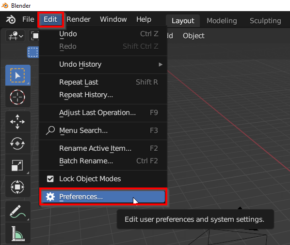

3. In the *Blender Preferences* window, click *Add-ons* > *Install...*
4. In the *Blender File View* window, find and install the plugin zip file e.g. *blender_jbeam_editor_0.1.0.zip*
5. Search for the plugin *Blender JBeam Editor*, click on the checkbox to enable the addon, and close the preferences window
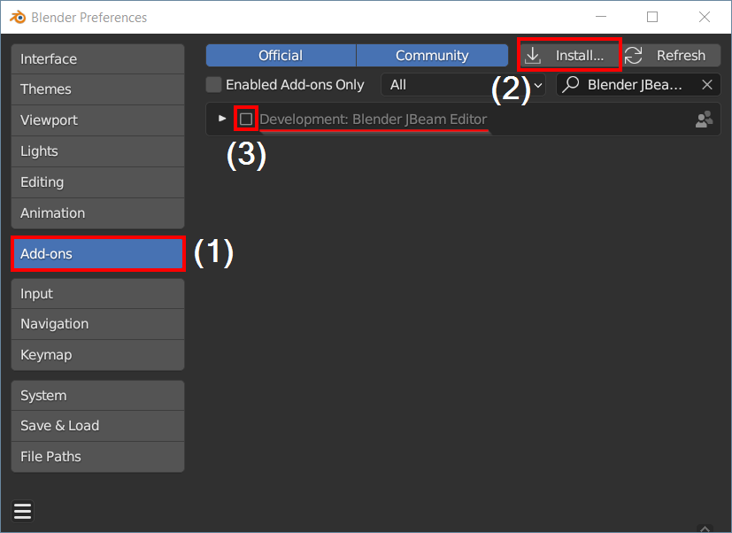

---

### Usage Instructions
With the plugin installed, you can finally start editing JBeam files! We will now go over some of the basic functionalities of the editor. I will be showcasing the functionalities using an example vehicle called the [Square Donut](square_donut.zip).

 

#### Importing a JBeam Part to Edit
The very first thing to do is import your JBeam part in order to actually edit it.

1. On the upper left hand corner, click on *File* > *Import* > *JBeam File (.jbeam)*, and select the JBeam file to import in the *Blender File View* window. I chose to import *square_donut.jbeam*
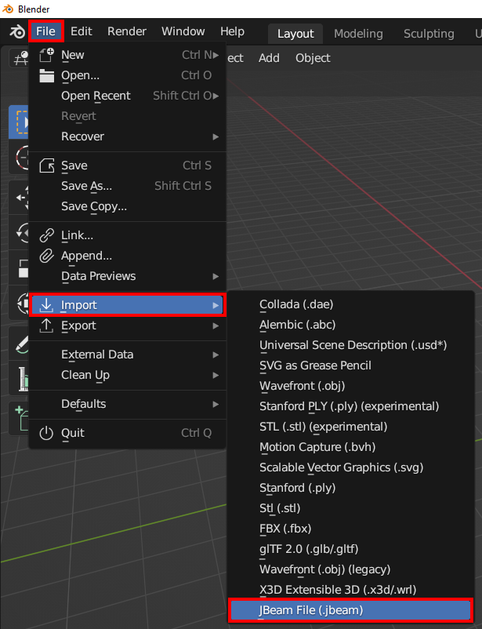

2. A *Choose JBeam* UI will popup which prompts you to select the part(s) you want to import into Blender. You can either choose a single part to import using the dropdown menu, or you can tick the *Import All Parts* checkbox to import all the parts. I chose to import a single part called *square_donut*. Press the *OK* button to import the part(s).

3. The JBeam parts should be imported now and you should see Blender meshes that look like JBeam structures. The JBeam parts are represented by a Blender mesh, where the vertices are the JBeam nodes, the edges are the JBeam beams, and the faces are the JBeam collision triangles. You should see node names next to the vertices (nodes). **From now on, I will only speak in JBeam terms (nodes, beams, collision triangles, etc.)**.
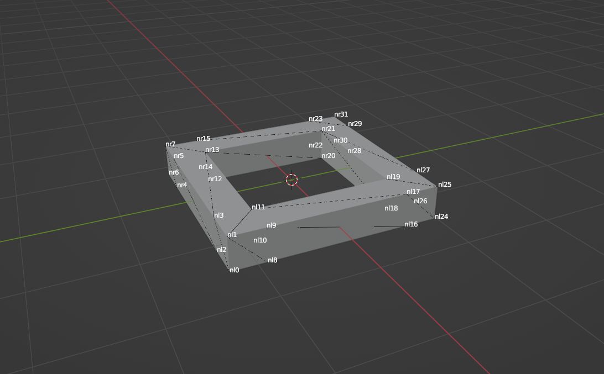

We are ready to start editing JBeam parts! For the most part, if you know how to use Blender, editing a JBeam part is just like editing a regular mesh. For example, moving a node is exactly the same as moving a regular vertex. The same applies for adding and deleting a node as well, although renaming a node is something unique to JBeam.

 

#### Create Part From Scratch
Another way to edit JBeam parts is to actually create them from scratch!

1. Select a regular mesh you want to turn into a JBeam part in *Object Mode* (default mode) through the dropdown menu in the upper left hand corner.
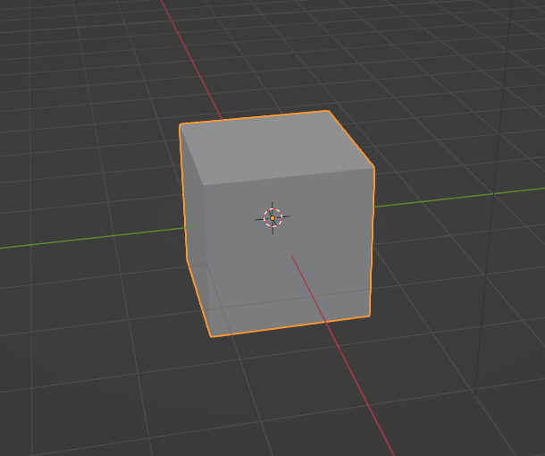

2. On the right hand side of the 3D Viewport right next to the 3D axes arrows, click on the little arrow pointing to the left.
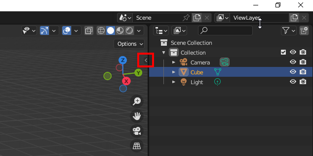

3. Several tabs will pop out such as *Item*, *Tool*, *View*, *JBeam*. Click on the *JBeam* tab and a UI will pop up showing you the JBeam part selected and allows you to convert the mesh into a "JBeam mesh/part". Click on the *Convert to JBeam Mesh* button.
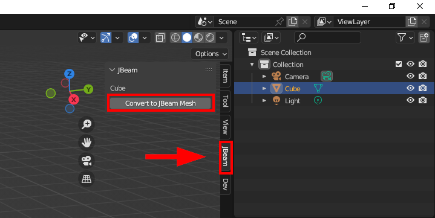

4. The cube mesh is now a "JBeam mesh/part" which allows you to edit it as a JBeam part and export it to a JBeam file. To confirm, you should see node names displayed on top of the JBeam part.
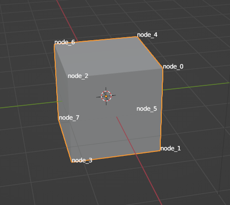

The rest of the tutorial uses the "Square Donut" JBeam part but can be followed along using this cube.

 

#### Moving a Node
Moving a node is just like moving a regular mesh vertex. There are multiple ways to move a node, but I'll show you one way to do it using the *Move* tool.

1. First, select the part, go into *Edit Mode* through the dropdown menu in the upper left hand corner, go into *Vertex selection mode* (selected by default), and select the *Select Box* tool.
2. Next, click on a node you want to move.
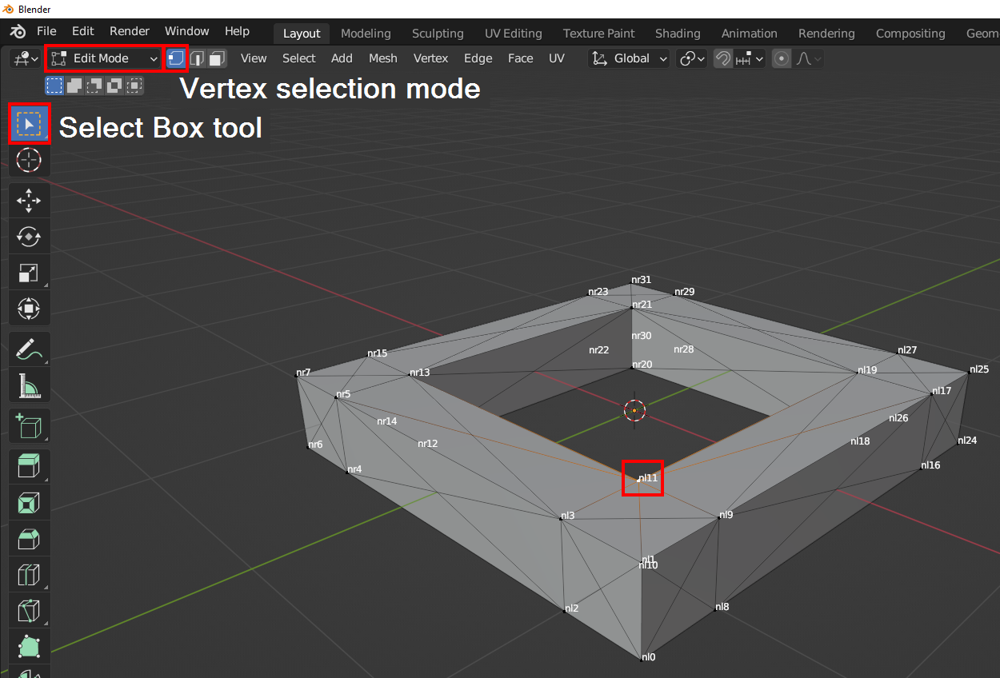

3. Then select the *Move* tool and move the node using the axes arrows.
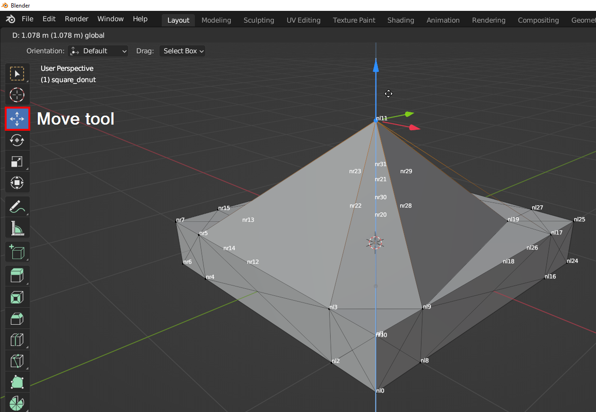

That wasn't too bad right? ;) Also thanks to Blender, you can undo (and redo) your changes simply with *Ctrl + Z* (and *Shift + Ctrl + Z*) to follow along with the next tutorial.

 

#### Renaming a Node
Renaming a node is something unique to JBeam but is easy to do :)

1. First, select the part, go into *Edit Mode* through the dropdown menu in the upper left hand corner, go into *Vertex selection mode* (selected by default), and select the *Select Box* tool.
2. Next, click on the node you want to rename.

3. Then, on the right hand side of the 3D Viewport right next to the 3D axes arrows, click on the little arrow pointing to the left.
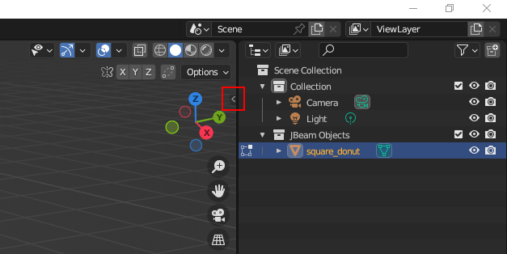

4. Several tabs will pop out such as *Item*, *Tool*, *View*, *JBeam*. Click on the *JBeam* tab and you will be greeted to a UI that shows you the JBeam part selected and allows you to rename the selected node. Rename the node to whatever you'd like and press enter. I renamed the node to "hey". You will see that the rename is also reflected in the node name labels on the part.

 

#### Adding a Node
Adding a node is just like adding a regular mesh vertex. There are many ways to add a node, but one way you can add them is using the *Extrude to Cursor or Add* function with your mouse and *Ctrl + Right Mouse Button*.

1. First, select the part, go into *Edit Mode* through the dropdown menu in the upper left hand corner, go into *Vertex selection mode* (selected by default), and select the *Select Box* tool.
2. Next, click on a node you want to extrude a node from.

3. Then, move your mouse to the place where you want to add a node and press *Ctrl + Right Mouse Button*. And a new node should appear under a new name of a long string of random characters. You can rename the node to whatever you like since you already know how to do that ;)
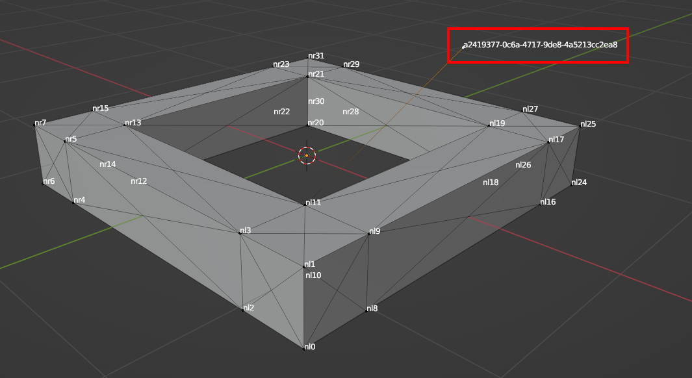

 

#### Deleting a Node
And again, deleting a node is just like deleting a regular mesh vertex. I'll show you how to delete them using the *del* key.

1. First, select the part, go into *Edit Mode* through the dropdown menu in the upper left hand corner, go into *Vertex selection mode* (selected by default), and select the *Select Box* tool.
2. Next, click on a node you want to delete.

3. Then simply press the *del* key and delete *Vertices*.
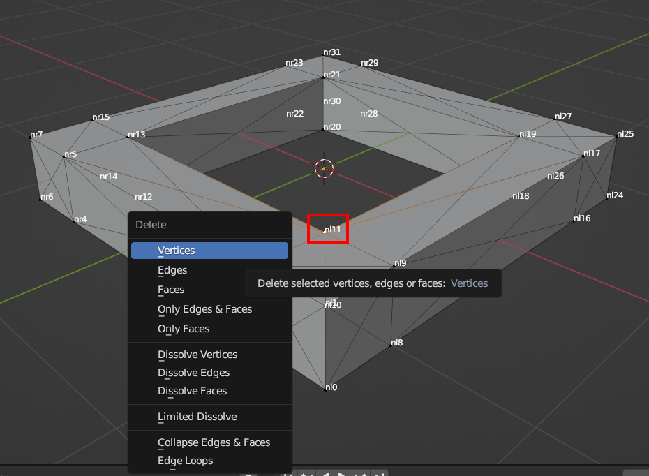

 

#### Exporting a JBeam Part
1. When you want to export, select the JBeam part in *Object Mode*, *File* > *Export* > *JBeam File* and export to a file (recommended to export back to imported JBeam file).
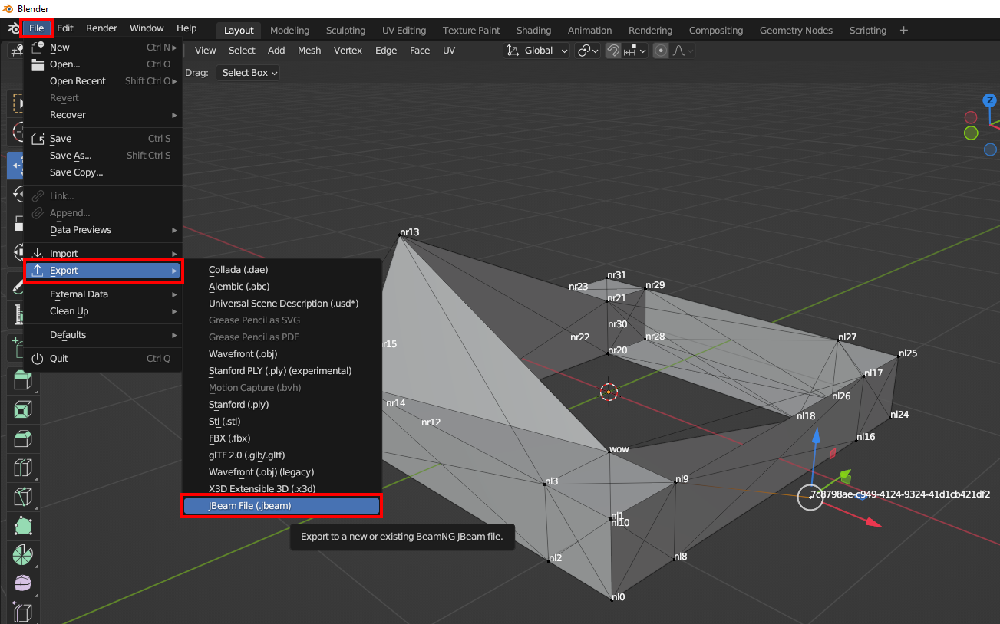
2. The exported JBeam file should be updated with minimal changes and no copying and pasting required :)
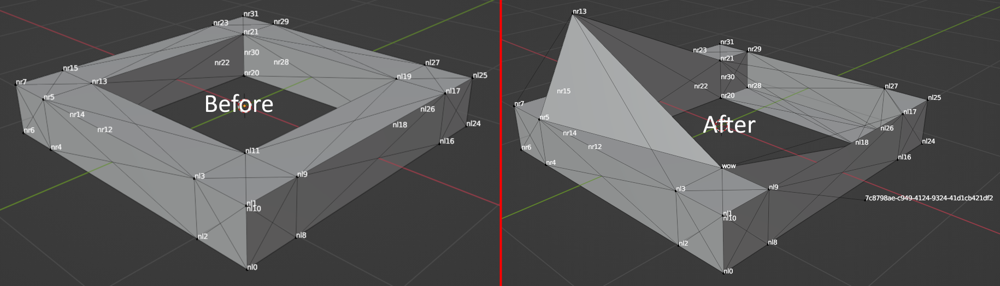
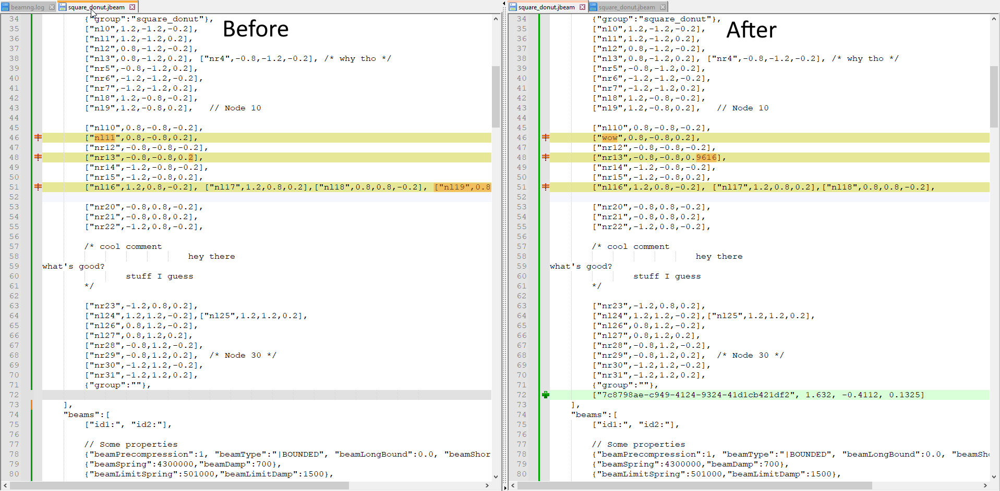