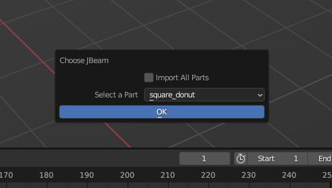

## Blender JBeam Editor User Documentation

### Introduction
This Blender plugin allows you to import existing JBeam parts or whole vehicles, modify them with Blender's advanced modelling tools, and export them! This tutorial will teach you how to use it.

---

### JBeam Editor Features

* Import JBeam files
* Import Full Vehicle (.pc file)
* Create JBeam from scratch (on hold)
* Move/rename/add/delete nodes
* Add/delete beams, triangles, and quads
* Undo/redo changes
* Live updates reflected in Blender text editor
* Export changes directly to disk

---

### Prerequisites
* Blender 4.0
    * Download and install from the official site https://www.blender.org/
* Blender JBeam Editor
    * Download from the *GitHub Releases* page https://github.com/BeamNG/Blender-JBeam-Editor/releases or build the plugin yourself from the source code

---

### Plugin Installation
1. Open Blender 4.0
2. On the upper left hand corner, click on *Edit* > *Preferences...*

    

4. In the *Blender Preferences* window, click *Add-ons* > *Install...*
5. In the *Blender File View* window, find and install the plugin zip file e.g. *blender_jbeam_editor_0.1.0.zip*
6. Search for the plugin *Blender JBeam Editor*, click on the checkbox to enable the addon, and close the preferences window

    

---

### Usage Instructions
With the plugin installed, you can finally start editing JBeam files! We will now go over some of the basic functionalities of the editor. I will be showcasing the functionalities using an example vehicle called the [Square Donut](square_donut.zip).

 

#### Importing a JBeam Part to Edit
The very first thing to do is import your JBeam part in order to actually edit it.

1. On the upper left hand corner, click on *File* > *Import* > *JBeam File (.jbeam)*, and select the JBeam file to import in the *Blender File View* window. I chose to import *square_donut.jbeam*

    

2. A *Choose JBeam* UI will popup which prompts you to select the part(s) you want to import into Blender. You can either choose a single part to import using the dropdown menu, or you can tick the *Import All Parts* checkbox to import all the parts. I chose to import a single part called *square_donut*. Press the *OK* button to import the part(s).

    

3. Wait a second or two and the JBeam part(s) will be imported!

    

 

#### Importing a Vehicle to Edit
Or you can import a full vehicle! Initially, this requires you need to extract the JBeam files and .pc files from BeamNG.drive's game installation folder so you can actually load in the vehicle.

1. Run the jbeam_pc_files_extractor.bat script (make sure Python is installed) to extract the .jbeam files and .pc files from the BeamNG.drive's installation folder. You'll be prompted to choose the *\content\vehicles* folder located in the game installation folder (e.g. *C:\Program Files (x86)\Steam\steamapps\common\BeamNG.drive\content\vehicles*). Then choose the folder to export the files to, and you can pick any folder.
    
    

    The resulting files should look like this, for example in the *bastion* folder:
    

2. Now in Blender, on the upper left hand corner, click on *File* > *Import* > *Part Config File (.pc)*, and select the .pc file to import from the exported JBeam/PC files folder.

    

3. Wait a few seconds and the vehicle will be imported!

    

 

#### After Importing
With the JBeam imported, you should see Blender meshes that represent the JBeam structures. The vertices are the JBeam nodes, the **green** edges are the JBeam beams (black edges are just part of a triangle/quad and aren't JBeam beams), and the faces are the JBeam triangles/quads. When you click on a JBeam part, you should see node names appear next to the vertices/nodes (if Toggle Node IDs Text is on, on by default). **From now on, I will only speak in JBeam terms (nodes, beams, triangles, quads, etc.)**.

One more step before moving on is to add a *Text Editor* view. Open it by placing your cursor on the top right hand corner of the viewport until you see your cursor turn into a '+' symbol and then LMB drag to the left and you should see a 2nd viewport. And then click on the top left button in that viewport that looks like a "grid and a circle" and click on *Text Editor*. Afterwards the text editor may appear blank. Just click on the JBeam part and the text editor should open the JBeam file that the part originates from.

We are ready to start editing the JBeam parts! For the most part, if you know how to use Blender, editing a JBeam part is just like editing a regular mesh. For example, moving a node is exactly the same as moving a regular vertex. The same applies for adding and deleting a node as well, although renaming a node is something unique to JBeam.

The rest of the instructions below will be using the *Square Donut* JBeam part and please have the JBeam part selected and be in *Edit Mode*.

 

#### Undoing/Redoing
Please use **Ctrl + [ and Ctrl + ]** to undo and redo your changes. **DO NOT** use Ctrl + Z and Ctrl + Shift + Z as Blender's undo system doesn't work well with this plugin and can break things.

 

#### Moving a Node
Moving a node is just like moving a regular mesh vertex. There are multiple ways to move a node, but I'll show you one way to do it using the *Move* tool.

1. Click on a node you want to move.
2. Then select the *Move* tool and move the node using the axes arrows.

    

That wasn't too bad right? ;)

 

#### Renaming a Node
Renaming a node is something unique to JBeam but is easy to do :)

1. Click on the node you want to rename.
2. Then, on the right hand side of the 3D Viewport right next to the 3D axes arrows, click on the little arrow pointing to the left.

    

3. Several tabs will pop out such as *Item*, *Tool*, *View*, *JBeam*. Click on the *JBeam* tab and you will be greeted to a UI that shows you the JBeam part selected and allows you to rename the selected node. Rename the node to whatever you'd like and press enter. I renamed the node to "hey". You will see that the rename is also reflected in the node name labels on the part.

    

 

#### Adding a Node
Adding a node is just like adding a regular mesh vertex. There are many ways to add a node, but one way you can add them is using the *Extrude to Cursor or Add* function with your mouse and *Ctrl + Right Mouse Button*.

1. Click on a node you want to extrude a node from.
2. Then, move your mouse to the place where you want to add a node and press *Ctrl + Right Mouse Button*. And a new node should appear under a new name of a long string of random characters. You can rename the node to whatever you like since you already know how to do that ;)

    

 

#### Deleting a Node
And again, deleting a node is just like deleting a regular mesh vertex. I'll show you how to delete them using the *del* key.

1. Click on a node you want to delete.
2. Then simply press the *del* key and delete *Vertices*.

 

#### Adding a Beam
There are two ways to add a beam.

The first way is:
1. Click on two nodes
2. Press *F*

The second way allows you to add multiple beams per pair of nodes:
1. Click on two nodes
2. In the JBeam UI tab to the right of the viewport, click on *Add Beam*

    

#### Deleting a Beam
Deleting a beam is pretty straight forward.

1. Switch into *Edge select* mode

    

2. Click on the beam you want to delete (beams are highlighted in green)
3. Press the *del* key and in the pop up click *Only Edges & Faces*

#### Adding a Triangle/Quad
There are two ways to add a triangle/quad.

The first way is:
1. Click on three/four nodes
2. Press *F*

The second way allows you to add multiple triangles/quads per set of nodes:
1. Click on three/four nodes
2. In the JBeam UI tab to the right of the viewport, click on *Add Triangle* / *Add Quad*

    

#### Deleting a Triangle/Quad
And deleting a triangle/quad is also pretty straight forward.

1. Switch into *Face select* mode

    

2. Click on the triangle/quad you want to delete
3. Press the *del* key and in the pop up click *Only Edges & Faces*

#### Exporting a JBeam Part
1. When you want to export, select the JBeam part in *Object Mode*, and in the top menu bar *File* > *Export* > *Selected JBeam Parts(s)*.

   

2. The JBeam file the part originated from will be exported to. And the file should be updated with minimal changes and no copying and pasting required :)

    
    
